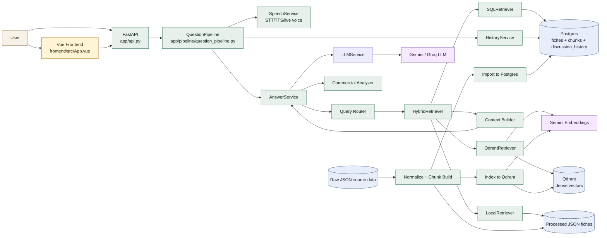
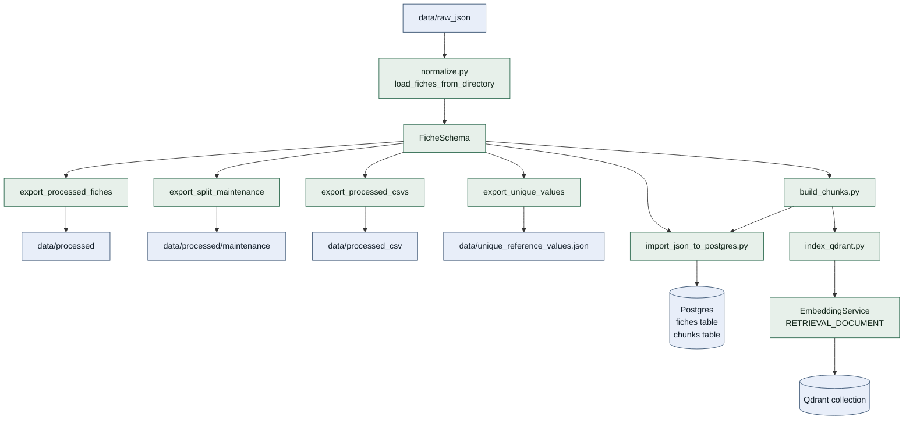
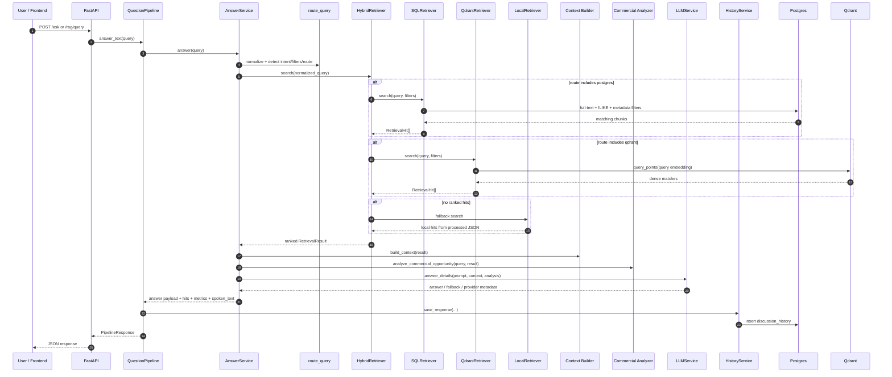
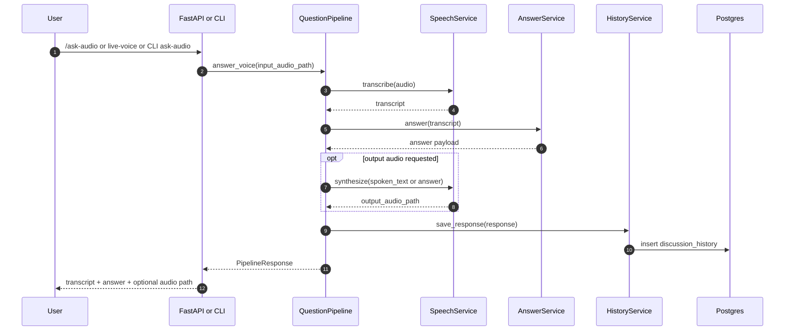
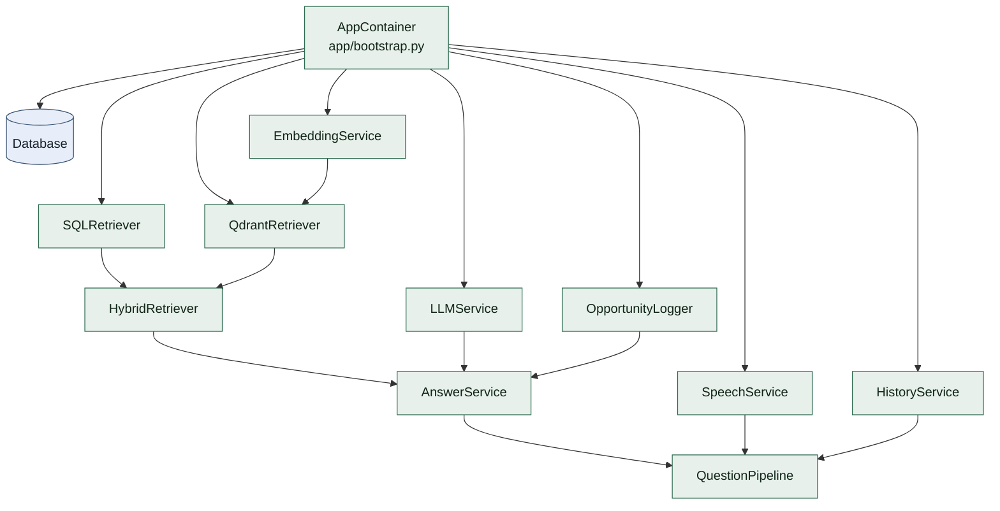

# Auralys Architecture Diagram

This document captures the current project architecture as implemented in the repository.

For the dedicated agent-layer view, see [auralys_agent_pipeline.md](C:/Users/Youss/OneDrive/Bureau/auralys/docs/auralys_agent_pipeline.md).

## 1. System Overview

## 2. Ingestion Pipeline

## 3. Text Query Runtime

## 4. Voice Query Runtime

## 5. Dependency Assembly

## 6. Main Responsibilities

- `app/main.py`: CLI entrypoint for ingestion, indexing, serving, evaluation, and voice commands.
- `app/api.py`: HTTP surface for health, reference values, RAG queries, history, and voice endpoints.
- `app/bootstrap.py`: dependency wiring through `AppContainer`.
- `app/ingestion/*`: normalization, exports, chunk building, Postgres ingestion, Qdrant indexing.
- `app/retrieval/*`: routing, SQL retrieval, dense retrieval, local fallback, reranking, context building.
- `app/embeddings/embedding_service.py`: dense embedding generation for Qdrant query and indexing.
- `app/llm/*`: prompt building, model invocation, token usage, answer shaping.
- `app/audio/speech_service.py`: STT, TTS, live microphone capture, voice output.
- `app/history/history_service.py`: persistence of conversation results into Postgres.
- `frontend/*`: Vue frontend for interacting with the API.

## 7. Regeneration Notes

When these areas change, the diagrams should usually be updated:

- retrieval routing or ranking logic
- ingestion targets or storage schema
- embedding provider/backend
- API endpoints
- pipeline assembly in `AppContainer`
