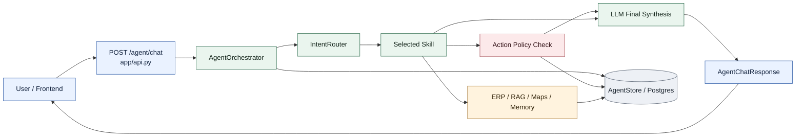
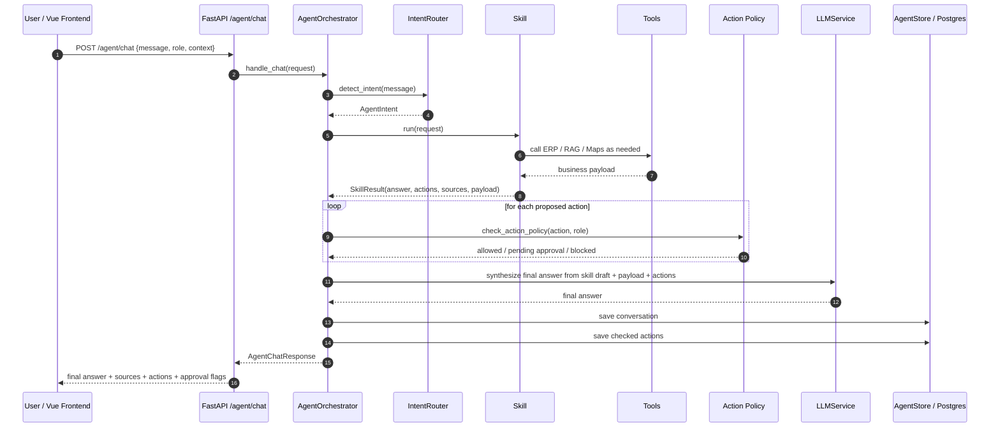
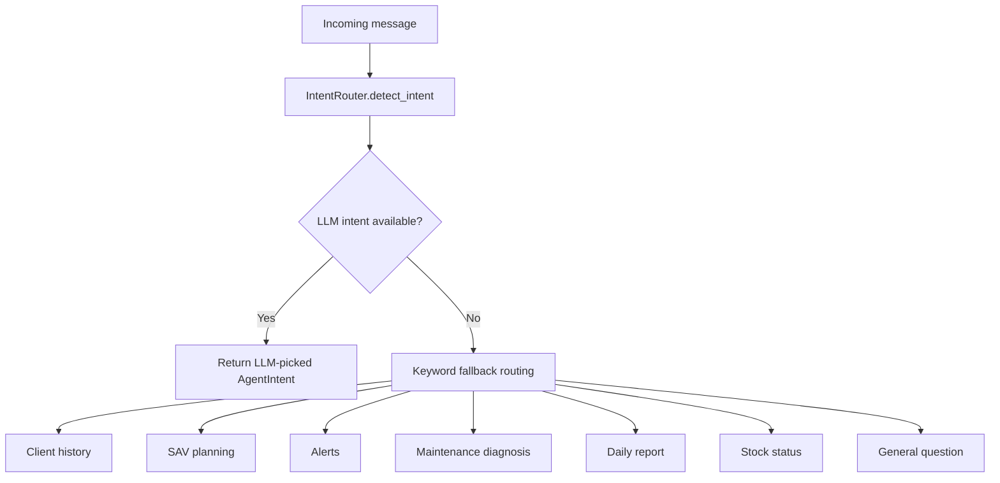
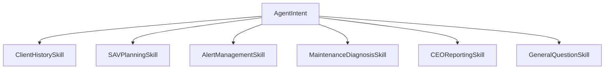
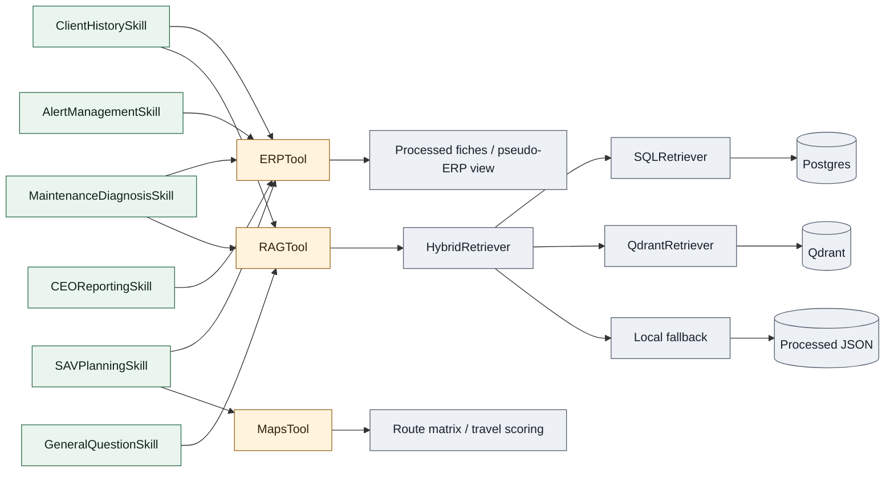
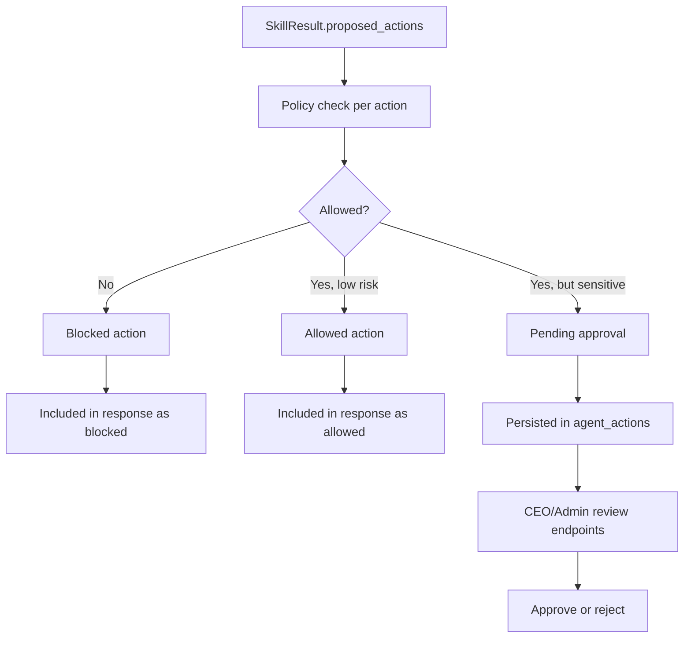
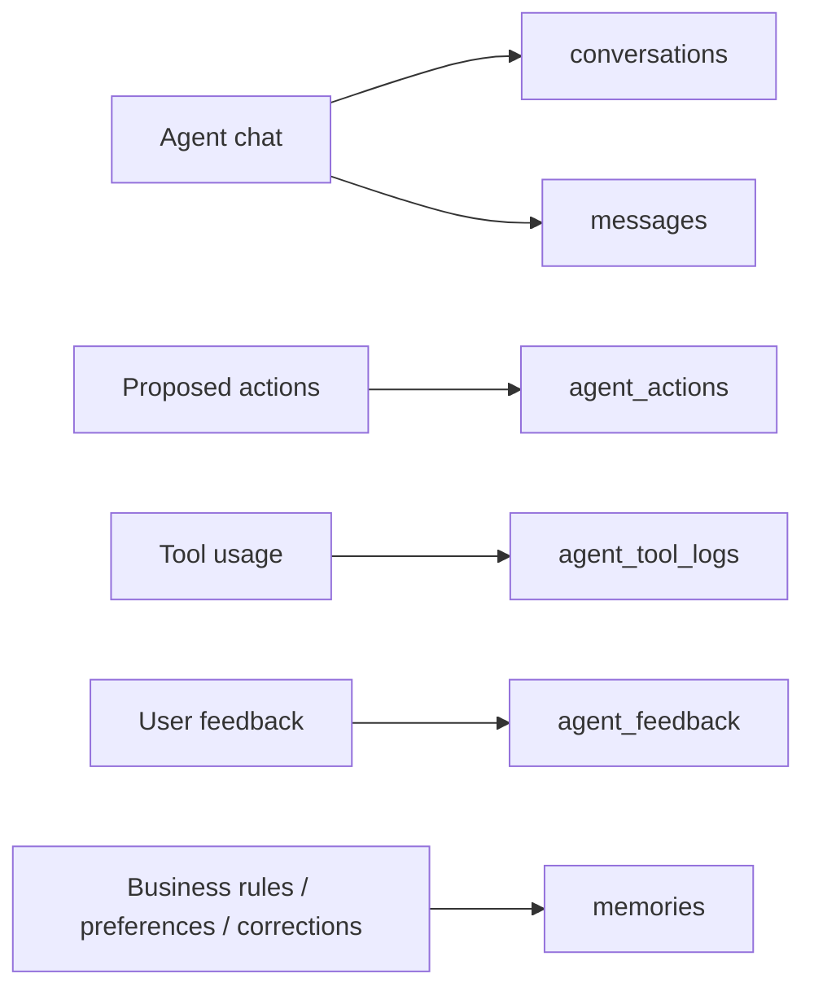
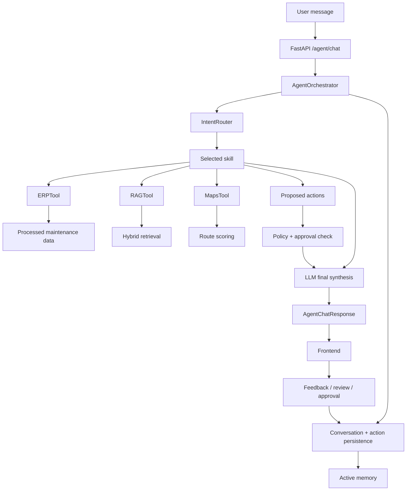

# Auralys Agent Pipeline

This document focuses on the **Auralys agent layer**: how a message enters the agent, how intent is routed, which skills and tools are used, where approval applies, and how memory and persistence fit into the architecture.

It complements the broader system view in [architecture_diagram.md](C:/Users/Youss/OneDrive/Bureau/auralys/docs/architecture_diagram.md).

## 1. Agent At A Glance

## 2. Main Runtime Flow

## 3. Intent Routing

The agent entrypoint is [AgentOrchestrator](C:/Users/Youss/OneDrive/Bureau/auralys/app/agent/core/orchestrator.py), but the first decision is made by [IntentRouter](C:/Users/Youss/OneDrive/Bureau/auralys/app/agent/core/intent_router.py).

Routing works in two stages:

1. Try LLM intent classification.
2. Fall back to keyword heuristics if the LLM classifier fails.

Current intents:

- `ASK_CLIENT_HISTORY`
- `ASK_NEXT_SAV_DESTINATION`
- `ASK_ALERTS`
- `ASK_MAINTENANCE_PROBLEM`
- `ASK_DAILY_REPORT`
- `ASK_STOCK_STATUS`
- `GENERAL_QUESTION`

## 4. Skill Layer

Once the intent is known, the orchestrator selects one skill implementation.

Current skill responsibilities:

- [ClientHistorySkill](C:/Users/Youss/OneDrive/Bureau/auralys/app/agent/skills/client_history.py): ERP history + interventions + reclamations + RAG client docs.
- [SAVPlanningSkill](C:/Users/Youss/OneDrive/Bureau/auralys/app/agent/skills/sav_planning.py): route recommendation from interventions, priority, and travel duration.
- [AlertManagementSkill](C:/Users/Youss/OneDrive/Bureau/auralys/app/agent/skills/alert_management.py): delayed reclamations and low-stock style alerts.
- [MaintenanceDiagnosisSkill](C:/Users/Youss/OneDrive/Bureau/auralys/app/agent/skills/maintenance_diagnosis.py): similar cases from RAG plus latest intervention context.
- [CEOReportingSkill](C:/Users/Youss/OneDrive/Bureau/auralys/app/agent/skills/ceo_reporting.py): operational summary for leadership review.
- [GeneralQuestionSkill](C:/Users/Youss/OneDrive/Bureau/auralys/app/agent/skills/general_question.py): direct conversational answer or lightweight RAG only when needed.

## 5. Tooling Under The Skills

The agent does not talk directly to infrastructure. Skills call tool abstractions.

### ERPTool

[ERPTool](C:/Users/Youss/OneDrive/Bureau/auralys/app/agent/tools/erp.py) is not an external ERP integration yet. It builds a business-facing operational view from processed maintenance fiches:

- client lookup
- client history
- interventions
- reclamations
- stock approximation
- opening-hours heuristics
- diffuser state

### RAGTool

[RAGTool](C:/Users/Youss/OneDrive/Bureau/auralys/app/agent/tools/rag.py) wraps the repository’s hybrid retrieval stack:

- SQL exact retrieval
- Qdrant semantic retrieval
- local JSON fallback

### MapsTool

[MapsTool](C:/Users/Youss/OneDrive/Bureau/auralys/app/agent/tools/maps.py) currently computes route duration/distance from coordinates using local math rather than a live external map API.

### MemoryTool

[MemoryTool](C:/Users/Youss/OneDrive/Bureau/auralys/app/agent/tools/memory.py) persists:

- feedback
- pending memory
- business rules
- user preferences

## 6. Action Policy And Approval Flow

Skills may propose actions, but those actions do not execute freely.

The orchestrator applies:

- `check_action_policy(...)`
- `apply_policy(...)`

This determines whether an action is:

- allowed
- blocked
- pending approval

Relevant endpoints:

- `GET /agent/actions/pending`
- `POST /agent/actions/{action_id}/approve`
- `POST /agent/actions/{action_id}/reject`

## 7. Final Answer Synthesis

The skill does not always produce the final user-facing wording directly.

[AgentOrchestrator](C:/Users/Youss/OneDrive/Bureau/auralys/app/agent/core/orchestrator.py) takes:

- the detected intent
- the skill draft answer
- the sources
- the checked actions
- a compact payload excerpt

and sends them to `LLMService.answer_details(...)` to produce the final response.

This gives a two-layer agent response:

1. **Business/tool layer**: structured skill output.
2. **Language layer**: final concise natural-language answer.

## 8. Persistence Model

The agent persists multiple artifacts through [AgentStore](C:/Users/Youss/OneDrive/Bureau/auralys/app/agent/store.py).

Persisted layers:

- conversation row
- user message
- assistant message
- proposed actions
- tool logs
- feedback
- active memory

## 9. Role Of The Frontend

The current Vue frontend mainly uses the agent through:

- `POST /agent/chat`
- review/admin endpoints for CEO space
- memory/conversation inspection endpoints

So the frontend is not only a chat surface. It is also:

- an approval console
- a review queue
- a memory browser
- a conversation inspector

## 10. Agent Pipeline In One View

## 11. Practical Reading Guide

If you want to understand the agent implementation quickly, read in this order:

1. [app/api.py](C:/Users/Youss/OneDrive/Bureau/auralys/app/api.py) for the HTTP entrypoints.
2. [app/bootstrap.py](C:/Users/Youss/OneDrive/Bureau/auralys/app/bootstrap.py) for dependency wiring.
3. [app/agent/core/orchestrator.py](C:/Users/Youss/OneDrive/Bureau/auralys/app/agent/core/orchestrator.py) for the main control flow.
4. [app/agent/core/intent_router.py](C:/Users/Youss/OneDrive/Bureau/auralys/app/agent/core/intent_router.py) for routing decisions.
5. `app/agent/skills/*` for business behaviors by intent.
6. `app/agent/tools/*` for data/tool abstractions.
7. [app/agent/store.py](C:/Users/Youss/OneDrive/Bureau/auralys/app/agent/store.py) for persistence and approval state.
